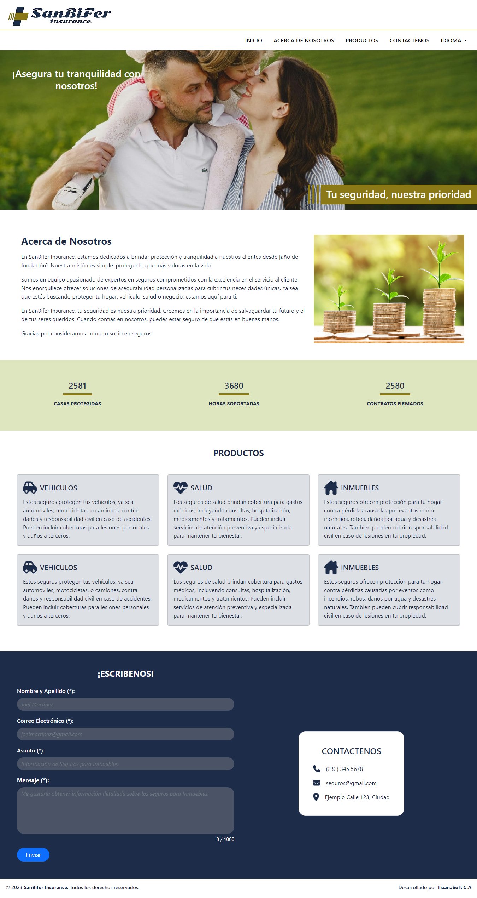

# landing-sanbifer-insurance

## Descripción (Description) 📋
Landing Page para la empresa de seguros SanBifer Insurance.

## Características (Features) ❤️

* Página de destino (landing page).

* Internalización (Español - Ingles).

* Formulario para solicitud de presupuesto o contacto.

* Envios de notificaciones de solicitud de contacto vía email.

## Herramientas (Tools) 🛠️

* HTML5

* CSS3 

* JavaScript

* Django

* Bootstrap

## Equipo (Team) ✒️

A continuación se menciona a todos aquellos que ayudaron a levantar el proyecto desde sus inicios:

* **Luis Achique** - *Lider Técnico* - [GitHub: @achique-luisdan](https://github.com/achique-luisdan)
* **Edwuard Madriz** - *Desarrollador Web* - [GitHub: @Ed-wuard](https://github.com/Ed-wuard)